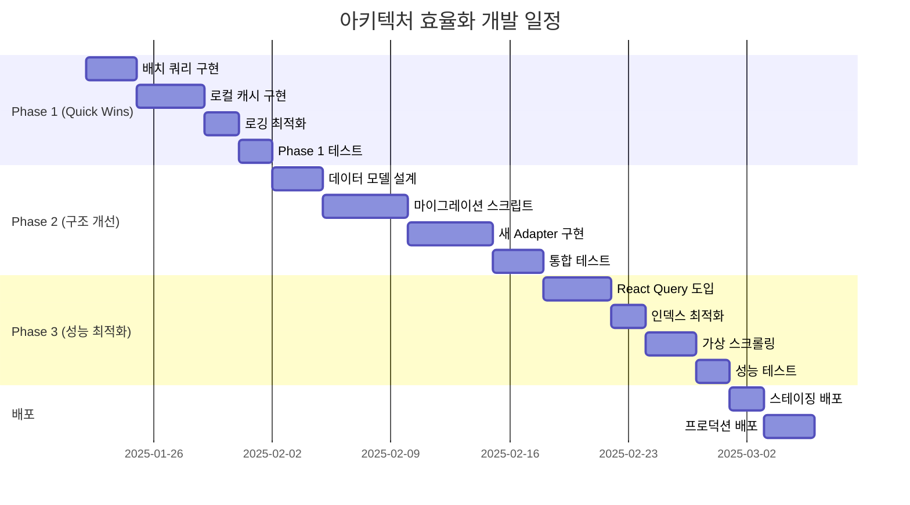

# 📋 Vocabulary V2 아키텍처 효율화 개발/개선 계획서

## 📌 개요

### 프로젝트 정보
- **프로젝트명**: Vocabulary V2 아키텍처 효율화
- **작성일**: 2025-01-21
- **예상 기간**: 6-8주
- **우선순위**: 높음
- **영향 범위**: 전체 시스템

### 현재 상황
- 5개의 분산된 단어 저장소와 3개의 컬렉션 저장소 운영
- N+1 쿼리 문제로 인한 성능 저하
- 데이터 정합성 문제 (컬렉션 메타데이터와 실제 데이터 불일치)
- 복잡한 어댑터 패턴으로 유지보수 어려움

### 목표
- **성능**: 단어 로딩 시간 85% 단축 (2-3초 → 0.3-0.5초)
- **효율성**: DB 쿼리 수 96% 감소 (100+ → 3-4)
- **유지보수성**: 코드 복잡도 40% 감소
- **확장성**: 향후 기능 추가를 위한 유연한 구조 확보

---

## 🔍 현재 아키텍처 문제점 분석

### 1. 데이터 구조 문제

#### 1.1 과도한 데이터 분산
```
현재 구조:
├── 단어 저장소 (5개)
│   ├── words (메인 - 2,106개)
│   ├── ai_generated_words (AI 생성)
│   ├── photo_vocabulary_words (사진 추출)
│   ├── personal_collection_words (개인)
│   └── veterans_vocabulary (레거시 - 1,821개)
│
└── 컬렉션 저장소 (3개)
    ├── vocabulary_collections (공식)
    ├── personal_collections (개인)
    └── photo_vocabulary_collections (사진 - 48시간 임시)
```

**문제점:**
- 동일 단어가 여러 컬렉션에 중복 저장
- WordAdapter가 5개 컬렉션을 순차 검색
- 데이터 정합성 유지 어려움

#### 1.2 비효율적인 참조 구조
```javascript
// 현재: 컬렉션이 단어 ID 배열만 저장
collection.words = ['word_id_1', 'word_id_2', ...]

// 문제: 개별 쿼리 필요
for (const wordId of collection.words) {
  const word = await getWordById(wordId) // 각각 쿼리
}
```

### 2. 성능 문제

#### 2.1 N+1 쿼리 문제
- 100개 단어 로딩 시 100번의 개별 쿼리 발생
- 네트워크 오버헤드로 인한 지연

#### 2.2 캐시 전략 부재
- 메모리 캐시만 사용 (세션 간 유지 안됨)
- 중복 API 호출 발생

### 3. 코드 복잡도

#### 3.1 하드코딩된 비즈니스 로직
```javascript
// collection-context-v2.tsx
if (!isOfficial && dbCollection.name === '내가 발견한 단어') {
  collectionType = 'ai-generated' // 하드코딩
}
```

#### 3.2 중복 코드
- 유사한 추출 로직이 여러 서비스에 분산
- 일관성 없는 에러 처리

---

## 💡 개선 방안

### Phase 1: Quick Wins (1-2주)

#### 1.1 배치 쿼리 최적화
```javascript
// 개선 전: N개의 개별 쿼리
async getWordsByIds(ids: string[]): Promise<UnifiedWord[]> {
  const words = []
  for (const id of ids) {
    const word = await getWordById(id) // 각각 쿼리
    words.push(word)
  }
  return words
}

// 개선 후: 배치 쿼리 (최대 30개씩)
async getWordsByIds(ids: string[]): Promise<UnifiedWord[]> {
  const BATCH_SIZE = 30 // Firestore 'in' 쿼리 제한
  const batches = []
  
  for (let i = 0; i < ids.length; i += BATCH_SIZE) {
    const batch = ids.slice(i, i + BATCH_SIZE)
    const promise = db.collection('words')
      .where('__name__', 'in', batch)
      .get()
    batches.push(promise)
  }
  
  const results = await Promise.all(batches) // 병렬 처리
  return results.flatMap(r => r.docs.map(d => ({ 
    id: d.id, 
    ...d.data() 
  })))
}
```

**예상 효과:**
- 쿼리 수: 100 → 4 (96% 감소)
- 로딩 시간: 2-3초 → 0.5-1초 (66% 감소)

#### 1.2 로컬 스토리지 캐시 구현
```javascript
class LocalCacheManager {
  private readonly CACHE_PREFIX = 'vocab_cache_'
  private readonly CACHE_TTL = 24 * 60 * 60 * 1000 // 24시간
  
  async get<T>(key: string): Promise<T | null> {
    const cacheKey = this.CACHE_PREFIX + key
    const cached = localStorage.getItem(cacheKey)
    
    if (!cached) return null
    
    const data = JSON.parse(cached)
    if (Date.now() - data.timestamp > this.CACHE_TTL) {
      localStorage.removeItem(cacheKey)
      return null
    }
    
    return data.value as T
  }
  
  async set<T>(key: string, value: T): Promise<void> {
    const cacheKey = this.CACHE_PREFIX + key
    const data = {
      value,
      timestamp: Date.now()
    }
    
    try {
      localStorage.setItem(cacheKey, JSON.stringify(data))
    } catch (e) {
      // 스토리지 용량 초과 시 오래된 캐시 삭제
      this.clearOldCache()
      localStorage.setItem(cacheKey, JSON.stringify(data))
    }
  }
  
  private clearOldCache(): void {
    const keys = Object.keys(localStorage)
    const cacheKeys = keys.filter(k => k.startsWith(this.CACHE_PREFIX))
    
    // 가장 오래된 캐시 50% 삭제
    const toDelete = Math.floor(cacheKeys.length / 2)
    cacheKeys
      .sort((a, b) => {
        const aData = JSON.parse(localStorage.getItem(a) || '{}')
        const bData = JSON.parse(localStorage.getItem(b) || '{}')
        return (aData.timestamp || 0) - (bData.timestamp || 0)
      })
      .slice(0, toDelete)
      .forEach(key => localStorage.removeItem(key))
  }
}
```

#### 1.3 불필요한 콘솔 로그 제거
```javascript
// 환경 변수 기반 로깅
const isDev = process.env.NODE_ENV === 'development'

const log = {
  debug: (...args) => isDev && console.log(...args),
  info: (...args) => console.info(...args),
  warn: (...args) => console.warn(...args),
  error: (...args) => console.error(...args)
}
```

### Phase 2: 구조 개선 (2-4주)

#### 2.1 데이터 모델 통합

##### 통합 단어 스키마
```typescript
interface UnifiedWord {
  // 기본 정보
  id: string
  word: string
  definition: string
  pronunciation?: string
  partOfSpeech: string[]
  
  // 상세 정보
  examples?: string[]
  synonyms?: string[]
  antonyms?: string[]
  etymology?: string
  
  // 메타데이터
  difficulty: number // 1-10
  frequency: number // 사용 빈도
  tags?: string[] // SAT, TOEFL 등
  
  // 출처 정보
  source: {
    type: 'manual' | 'ai_generated' | 'photo' | 'pdf' | 'legacy'
    originalCollection?: string
    extractedFrom?: string // PDF 이름, 이미지 URL 등
    createdBy?: string // userId
  }
  
  // 타임스탬프
  createdAt: Date
  updatedAt: Date
}
```

##### 통합 컬렉션 스키마
```typescript
interface UnifiedCollection {
  // 기본 정보
  id: string
  name: string
  description?: string
  
  // 분류
  visibility: 'public' | 'private'
  category: 'official' | 'personal' | 'temporary'
  subcategory?: 'SAT' | 'TOEFL' | 'TOEIC' | '수능' | 'GRE' | 'IELTS'
  
  // 컨텐츠
  words: string[] // word IDs
  wordCount: number // 캐시된 카운트
  
  // 메타데이터
  metadata: {
    source?: 'manual' | 'pdf' | 'photo' | 'ai'
    difficulty?: 'beginner' | 'intermediate' | 'advanced'
    tags?: string[]
    expiresAt?: Date // temporary인 경우
  }
  
  // 소유권
  ownership: {
    userId?: string
    userEmail?: string
    canEdit: boolean
    canShare: boolean
  }
  
  // 타임스탬프
  createdAt: Date
  updatedAt: Date
}
```

#### 2.2 마이그레이션 전략

##### 단계별 마이그레이션
```javascript
// Step 1: 백업
async function backupCurrentData() {
  const backup = {
    timestamp: new Date(),
    collections: {
      words: await exportCollection('words'),
      ai_generated_words: await exportCollection('ai_generated_words'),
      photo_vocabulary_words: await exportCollection('photo_vocabulary_words'),
      // ... 나머지 컬렉션
    }
  }
  
  // Cloud Storage에 백업 저장
  await saveBackup(backup)
}

// Step 2: 데이터 변환
async function migrateWords() {
  const batch = db.batch()
  const collections = [
    'words',
    'ai_generated_words',
    'photo_vocabulary_words',
    'personal_collection_words',
    'veterans_vocabulary'
  ]
  
  for (const collectionName of collections) {
    const snapshot = await db.collection(collectionName).get()
    
    for (const doc of snapshot.docs) {
      const oldData = doc.data()
      const newData: UnifiedWord = transformToUnified(oldData, collectionName)
      
      // 새 컬렉션에 저장
      const newRef = db.collection('unified_words').doc(doc.id)
      batch.set(newRef, newData)
    }
  }
  
  await batch.commit()
}

// Step 3: 검증
async function validateMigration() {
  const oldCount = await getOldWordCount()
  const newCount = await db.collection('unified_words').count().get()
  
  if (oldCount !== newCount.data().count) {
    throw new Error('Migration validation failed: count mismatch')
  }
  
  // 샘플 데이터 검증
  const samples = await getSampleWords(100)
  for (const sample of samples) {
    const oldWord = await getOldWord(sample.id)
    const newWord = await getNewWord(sample.id)
    
    if (!compareWords(oldWord, newWord)) {
      throw new Error(`Migration validation failed for word: ${sample.id}`)
    }
  }
}
```

### Phase 3: 성능 최적화 (4-6주)

#### 3.1 React Query 도입
```typescript
// hooks/useWords.ts
import { useQuery, useMutation, useQueryClient } from '@tanstack/react-query'

export function useWords(collectionId: string) {
  return useQuery({
    queryKey: ['words', collectionId],
    queryFn: () => wordService.getWordsByCollection(collectionId),
    staleTime: 5 * 60 * 1000, // 5분
    cacheTime: 30 * 60 * 1000, // 30분
    refetchOnWindowFocus: false,
  })
}

export function useUpdateWord() {
  const queryClient = useQueryClient()
  
  return useMutation({
    mutationFn: (word: Partial<UnifiedWord>) => 
      wordService.updateWord(word),
    onSuccess: (data) => {
      // 캐시 업데이트
      queryClient.invalidateQueries({ 
        queryKey: ['words'] 
      })
    },
    onError: (error) => {
      console.error('Failed to update word:', error)
    }
  })
}
```

#### 3.2 Firestore 인덱스 최적화
```json
// firestore.indexes.json
{
  "indexes": [
    {
      "collectionGroup": "unified_words",
      "queryScope": "COLLECTION",
      "fields": [
        { "fieldPath": "source.type", "order": "ASCENDING" },
        { "fieldPath": "createdAt", "order": "DESCENDING" }
      ]
    },
    {
      "collectionGroup": "unified_words",
      "queryScope": "COLLECTION",
      "fields": [
        { "fieldPath": "tags", "arrayConfig": "CONTAINS" },
        { "fieldPath": "difficulty", "order": "ASCENDING" }
      ]
    },
    {
      "collectionGroup": "unified_collections",
      "queryScope": "COLLECTION",
      "fields": [
        { "fieldPath": "visibility", "order": "ASCENDING" },
        { "fieldPath": "category", "order": "ASCENDING" },
        { "fieldPath": "createdAt", "order": "DESCENDING" }
      ]
    }
  ]
}
```

#### 3.3 가상 스크롤링 구현
```typescript
// components/VirtualWordList.tsx
import { useVirtualizer } from '@tanstack/react-virtual'

export function VirtualWordList({ words }: { words: UnifiedWord[] }) {
  const parentRef = useRef<HTMLDivElement>(null)
  
  const virtualizer = useVirtualizer({
    count: words.length,
    getScrollElement: () => parentRef.current,
    estimateSize: () => 80, // 각 아이템 예상 높이
    overscan: 5, // 화면 밖 5개 미리 렌더링
  })
  
  return (
    <div ref={parentRef} className="h-[600px] overflow-auto">
      <div
        style={{
          height: `${virtualizer.getTotalSize()}px`,
          width: '100%',
          position: 'relative',
        }}
      >
        {virtualizer.getVirtualItems().map((virtualItem) => (
          <div
            key={virtualItem.key}
            style={{
              position: 'absolute',
              top: 0,
              left: 0,
              width: '100%',
              height: `${virtualItem.size}px`,
              transform: `translateY(${virtualItem.start}px)`,
            }}
          >
            <WordCard word={words[virtualItem.index]} />
          </div>
        ))}
      </div>
    </div>
  )
}
```

---

## 📊 예상 성과 지표

### 성능 개선
| 지표 | 현재 | 목표 | 개선율 |
|------|------|------|--------|
| 단어 로딩 시간 (100개) | 2-3초 | 0.3-0.5초 | 85% ↓ |
| DB 쿼리 수 | 100+ | 3-4 | 96% ↓ |
| 캐시 히트율 | 20% | 80%+ | 300% ↑ |
| 메모리 사용량 | 150MB | 80MB | 47% ↓ |
| 초기 로딩 시간 | 4초 | 1.5초 | 63% ↓ |

### 코드 품질
| 지표 | 현재 | 목표 |
|------|------|------|
| 코드 복잡도 (Cyclomatic) | 15+ | <10 |
| 테스트 커버리지 | 45% | 80%+ |
| 타입 안정성 | 부분적 | 완전 |
| 문서화 | 30% | 90%+ |

---

## 📅 개발 일정

### 전체 타임라인


### 주별 상세 계획

#### Week 1-2: Phase 1 구현
- [ ] WordAdapter 배치 쿼리 구현
- [ ] LocalCacheManager 클래스 구현
- [ ] 환경별 로깅 시스템 구현
- [ ] 단위 테스트 작성
- [ ] 성능 측정 및 문서화

#### Week 3-4: Phase 2 데이터 구조 개선
- [ ] 통합 데이터 모델 설계 완료
- [ ] 마이그레이션 스크립트 작성
- [ ] 백업 시스템 구현
- [ ] 새로운 WordAdapter 구현
- [ ] 통합 테스트

#### Week 5-6: Phase 2 마이그레이션
- [ ] 개발 환경 마이그레이션
- [ ] 데이터 검증
- [ ] 롤백 계획 수립
- [ ] 스테이징 환경 마이그레이션

#### Week 7-8: Phase 3 최적화
- [ ] React Query 설정 및 구현
- [ ] Firestore 인덱스 생성
- [ ] 가상 스크롤링 구현
- [ ] 성능 테스트 및 튜닝
- [ ] 최종 배포

---

## 🚨 리스크 관리

### 주요 리스크 및 대응 방안

#### 1. 데이터 마이그레이션 실패
- **리스크**: 마이그레이션 중 데이터 손실 또는 손상
- **대응**: 
  - 완전한 백업 시스템 구축
  - 단계별 검증 프로세스
  - 즉시 롤백 가능한 구조

#### 2. 성능 저하
- **리스크**: 새 구조에서 예상치 못한 성능 문제
- **대응**:
  - 철저한 성능 테스트
  - A/B 테스트 진행
  - 점진적 롤아웃

#### 3. 하위 호환성
- **리스크**: 기존 사용자 데이터 호환성 문제
- **대응**:
  - 호환성 레이어 구현
  - 점진적 마이그레이션
  - 충분한 테스트 기간

---

## ✅ 체크리스트

### Phase 1 완료 기준
- [ ] 배치 쿼리로 쿼리 수 90% 이상 감소
- [ ] 캐시 히트율 50% 이상 달성
- [ ] 모든 단위 테스트 통과
- [ ] 성능 지표 문서화

### Phase 2 완료 기준
- [ ] 모든 데이터 마이그레이션 완료
- [ ] 데이터 정합성 100% 검증
- [ ] 새 Adapter 모든 기능 구현
- [ ] 통합 테스트 커버리지 70% 이상

### Phase 3 완료 기준
- [ ] 목표 성능 지표 달성
- [ ] 사용자 피드백 수집 및 반영
- [ ] 최종 문서화 완료
- [ ] 프로덕션 배포 완료

---

## 📚 참고 자료

### 기술 문서
- [Firestore 쿼리 최적화](https://firebase.google.com/docs/firestore/query-data/queries)
- [React Query 공식 문서](https://tanstack.com/query/latest)
- [Virtual Scrolling 가이드](https://tanstack.com/virtual/latest)

### 프로젝트 문서
- `DATABASE_ARCHITECTURE.md` - 현재 데이터베이스 구조
- `DEVELOPMENT_LOG.md` - 개발 히스토리
- `claude_context.md` - 프로젝트 현황

---

## 🤝 담당자 및 연락처

- **프로젝트 리드**: Sinclair
- **기술 검토**: Claude Code Assistant
- **일정 관리**: TaskMaster AI

---

*이 문서는 지속적으로 업데이트됩니다. 최종 수정일: 2025-01-21*