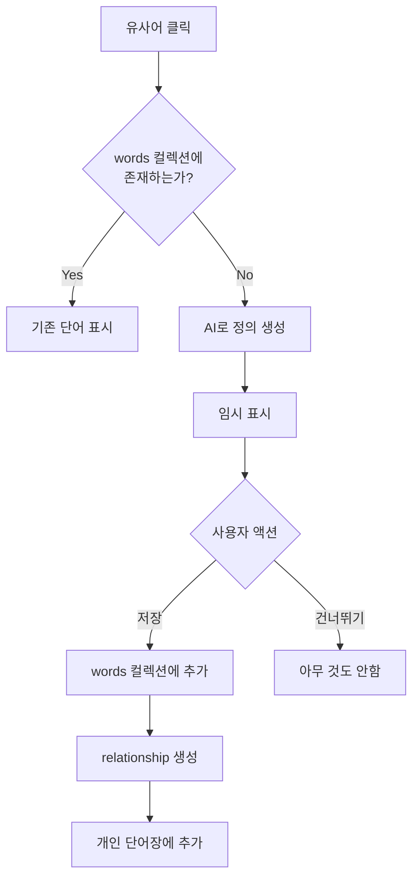

# Dynamic Vocabulary System - Redesigned Architecture

## Overview
현재 DB 구조를 유지하면서 동적 단어 확장을 지원하는 재설계된 시스템입니다.

## 현재 DB 구조 분석

### 기존 컬렉션들
```typescript
// 1. words - 모든 단어의 마스터 데이터
{
  id: string,
  word: string,
  definitions: Definition[],
  partOfSpeech: string[],
  // ... 기타 단어 정보
}

// 2. vocabulary_collections - 단어장 (ID 참조만)
{
  id: string,
  name: string,  // "veterans_vocabulary", "sat_core" 등
  words: string[],  // word ID 배열
  userId: string,
  // ... 메타데이터
}

// 3. user_words - 사용자별 학습 상태
{
  userId: string,
  wordId: string,
  studyStatus: StudyStatus,
  // ... 학습 기록
}
```

## 재설계된 아키텍처

### 1. Words 컬렉션 확장

기존 words 컬렉션에 새로운 필드를 추가하여 동적 단어를 지원합니다.

```typescript
interface Word {
  // 기존 필드들
  id: string
  word: string
  definitions: Definition[]
  partOfSpeech: string[]
  pronunciation?: string
  etymology?: Etymology
  examples: string[]
  difficulty: number
  frequency: number
  
  // 새로 추가되는 필드들
  source: {
    type: 'veterans_pdf' | 'dynamic' | 'external_api' | 'user_manual'
    origin?: string  // PDF 파일명, API 이름 등
    addedBy?: string  // 추가한 사용자 ID (dynamic인 경우)
    addedAt: Date
    verified?: boolean  // 검증 여부
  }
  
  // 동적 발견 메타데이터 (dynamic 타입인 경우만)
  discovery?: {
    fromWordId?: string  // 어떤 단어에서 발견되었는지
    fromWord?: string    // 빠른 참조를 위한 단어
    relationship?: 'synonym' | 'antonym' | 'related'
    aiModel?: string     // 'gpt-4', 'claude-3' 등
    confidence?: number  // 0-1
  }
  
  // 기존 필드 유지
  createdAt: Date
  updatedAt: Date
}
```

### 2. 새로운 컬렉션들

#### word_relationships - 단어 간 관계
```typescript
interface WordRelationship {
  id: string
  word1Id: string  // words 컬렉션의 ID
  word2Id: string  // words 컬렉션의 ID
  
  // 비정규화된 데이터 (성능을 위해)
  word1: string
  word2: string
  
  relationship: {
    type: 'synonym' | 'antonym' | 'derived' | 'related'
    strength: number  // 0-1, 관계의 강도
    bidirectional: boolean  // 양방향 관계인지
  }
  
  source: {
    type: 'pdf' | 'ai' | 'user' | 'dictionary'
    confidence: number
    verifiedBy?: string[]  // 검증한 사용자들
  }
  
  createdAt: Date
  updatedAt: Date
  createdBy: string  // 관계를 만든 사용자
}
```

#### definition_variants - 다중 정의 관리
```typescript
interface DefinitionVariant {
  id: string
  wordId: string  // words 컬렉션의 ID
  word: string    // 빠른 검색을 위한 비정규화
  
  definition: {
    korean: string
    english?: string
    simplified?: string  // 초보자용 간단한 설명
  }
  
  source: {
    type: 'veterans_pdf' | 'ai' | 'dictionary' | 'user'
    name: string  // "V.ZIP 3K", "GPT-4", "네이버 사전" 등
    priority: number  // 1이 가장 높음
    addedAt: Date
  }
  
  usage: {
    domain?: string  // 'general', 'academic', 'business' 등
    formality?: 'formal' | 'informal' | 'neutral'
    examples?: string[]
  }
  
  validation: {
    votes: { helpful: number, notHelpful: number }
    verified?: boolean
    verifiedBy?: string
  }
  
  createdAt: Date
  updatedAt: Date
}
```

### 3. 사용자 개인 단어장 확장

```typescript
// 기존 vocabulary_collections에 새 단어장 타입 추가
{
  // 사용자가 발견한 단어들
  id: "user_123_discovered",
  name: "내가 발견한 단어",
  description: "학습 중 발견한 새로운 단어들",
  words: ["word_id_1", "word_id_2", ...],  // 동적으로 추가된 word ID들
  userId: "user_123",
  isPrivate: true,
  createdAt: Date,
  updatedAt: Date
}
```

## 데이터 플로우

### 1. 유사어 클릭 시 처리 과정



### 2. 단어 저장 과정

```typescript
// 1. words 컬렉션에 새 단어 추가
const newWord = {
  word: "omnipresent",
  definitions: [{
    text: "어디에나 존재하는, 편재하는",
    source: "AI Generated",
    partOfSpeech: "adj."
  }],
  partOfSpeech: ["adj."],
  source: {
    type: "dynamic",
    addedBy: "user_123",
    addedAt: new Date(),
    verified: false
  },
  discovery: {
    fromWordId: "word_ubiquitous_001",
    fromWord: "ubiquitous",
    relationship: "synonym",
    aiModel: "gpt-4",
    confidence: 0.92
  },
  // ... 기타 필드
}

const wordRef = await db.collection('words').add(newWord)

// 2. 관계 생성
await db.collection('word_relationships').add({
  word1Id: "word_ubiquitous_001",
  word2Id: wordRef.id,
  word1: "ubiquitous",
  word2: "omnipresent",
  relationship: {
    type: "synonym",
    strength: 0.9,
    bidirectional: true
  },
  source: {
    type: "ai",
    confidence: 0.92
  },
  createdBy: "user_123",
  createdAt: new Date()
})

// 3. 사용자 개인 단어장에 추가
await db.collection('vocabulary_collections')
  .doc('user_123_discovered')
  .update({
    words: firebase.firestore.FieldValue.arrayUnion(wordRef.id),
    updatedAt: new Date()
  })
```

## 정의 충돌 해결

### 1. 다중 정의 저장

V.ZIP PDF와 AI 생성 정의가 다른 경우:

```typescript
// sanction의 경우
// 1. words 컬렉션 (기본 정의)
{
  id: "word_sanction_001",
  word: "sanction",
  definitions: [{
    text: "제재",  // V.ZIP 정의
    source: "V.ZIP 3K",
    partOfSpeech: "n."
  }],
  source: {
    type: "veterans_pdf",
    origin: "vzip_3k.pdf"
  }
}

// 2. definition_variants 컬렉션 (추가 정의들)
[
  {
    wordId: "word_sanction_001",
    word: "sanction",
    definition: {
      korean: "승인, 허가; 제재, 처벌",
      english: "official approval; penalty"
    },
    source: {
      type: "ai",
      name: "GPT-4",
      priority: 2
    }
  },
  {
    wordId: "word_sanction_001",
    word: "sanction",
    definition: {
      korean: "공식적 허가; 처벌적 조치",
      english: "formal permission; punitive action"
    },
    source: {
      type: "dictionary",
      name: "Merriam-Webster",
      priority: 3
    }
  }
]
```

### 2. UI에서 표시 방법

```typescript
// 정의 가져오기
async function getWordWithAllDefinitions(wordId: string) {
  // 1. 기본 단어 정보
  const word = await db.collection('words').doc(wordId).get()
  
  // 2. 추가 정의들
  const variants = await db.collection('definition_variants')
    .where('wordId', '==', wordId)
    .orderBy('source.priority')
    .get()
  
  return {
    word: word.data(),
    primaryDefinition: word.data().definitions[0],  // V.ZIP 우선
    allDefinitions: [
      {
        ...word.data().definitions[0],
        source: word.data().source
      },
      ...variants.docs.map(d => d.data())
    ]
  }
}
```

## API 엔드포인트

### 1. 단어 발견 API

```typescript
// POST /api/vocabulary/discover
interface DiscoverRequest {
  word: string
  sourceWordId?: string
  relationship?: string
  userId: string
}

interface DiscoverResponse {
  word: string
  existsInDb: boolean
  wordId?: string  // 이미 있는 경우
  definition?: {  // 새로 생성한 경우
    korean: string
    confidence: number
  }
  suggestions: {
    synonyms: string[]
    relatedWords: string[]
  }
}
```

### 2. 단어 저장 API

```typescript
// POST /api/vocabulary/save-dynamic
interface SaveDynamicRequest {
  word: string
  definition: string
  sourceWordId?: string
  relationship?: string
  userId: string
}

interface SaveDynamicResponse {
  success: boolean
  wordId: string
  addedToCollections: string[]
}
```

## UI 컴포넌트 수정

### 1. WordDetailModal 수정

```typescript
interface WordDetailModalProps {
  word: Word | null
  onSynonymClick?: (synonym: string) => void
  // ... 기존 props
}

// 유사어 클릭 핸들러
const handleSynonymClick = async (synonym: string) => {
  // 1. DB에서 검색
  const existingWord = await vocabularyService.findByWord(synonym)
  
  if (existingWord) {
    // 기존 단어 모달로 전환
    setWord(existingWord)
  } else {
    // 발견 모달 표시
    setShowDiscoveryModal(true)
    setDiscoveringWord(synonym)
    
    // AI로 정의 생성
    const discovery = await discoverWord(synonym, word.id)
    setDiscoveryResult(discovery)
  }
}
```

### 2. DiscoveryModal 신규 컴포넌트

```typescript
interface DiscoveryModalProps {
  word: string
  sourceWord: Word
  relationship: string
  aiDefinition: {
    korean: string
    confidence: number
  }
  onSave: () => void
  onSkip: () => void
}

// 표시 내용:
// - 단어와 발음
// - AI 생성 정의 (신뢰도 표시)
// - "ubiquitous의 유사어" 같은 관계 표시
// - [내 단어장에 저장] [건너뛰기] 버튼
```

## 마이그레이션 전략

### 1. 기존 데이터 유지
- 모든 기존 words 데이터는 그대로 유지
- source 필드만 추가 (기본값: veterans_pdf)

### 2. 단계적 적용
1. 새 컬렉션 생성 (word_relationships, definition_variants)
2. API 엔드포인트 구현
3. UI 컴포넌트 업데이트
4. 사용자별 discovered 단어장 자동 생성

## 성능 고려사항

### 1. 인덱스 설정
```
words 컬렉션:
- word (단일 인덱스)
- source.type (단일 인덱스)
- source.addedBy (단일 인덱스)

word_relationships 컬렉션:
- word1Id (단일 인덱스)
- word2Id (단일 인덱스)
- (word1Id, relationship.type) (복합 인덱스)

definition_variants 컬렉션:
- wordId (단일 인덱스)
- (wordId, source.priority) (복합 인덱스)
```

### 2. 캐싱 전략
- 발견된 단어는 세션 동안 캐싱
- 관계 정보는 30분간 캐싱
- 정의 변형은 1시간 캐싱

## 보안 및 제한사항

### 1. 사용자 제한
- 하루 단어 발견: 100개
- 하루 저장: 50개
- 총 동적 단어: 5,000개/사용자

### 2. 콘텐츠 검증
- 부적절한 단어 필터링
- AI 생성 정의 검토
- 커뮤니티 신고 시스템

## 향후 확장 가능성

1. **커뮤니티 기능**
   - 검증된 동적 단어를 공개 단어장으로
   - 사용자 간 단어장 공유
   - 정의 투표 시스템

2. **AI 개선**
   - 사용자 피드백으로 정의 품질 향상
   - 문맥 기반 정의 생성
   - 다국어 지원

3. **학습 최적화**
   - 관련 단어 추천
   - 난이도별 학습 경로
   - 주제별 단어 그룹화