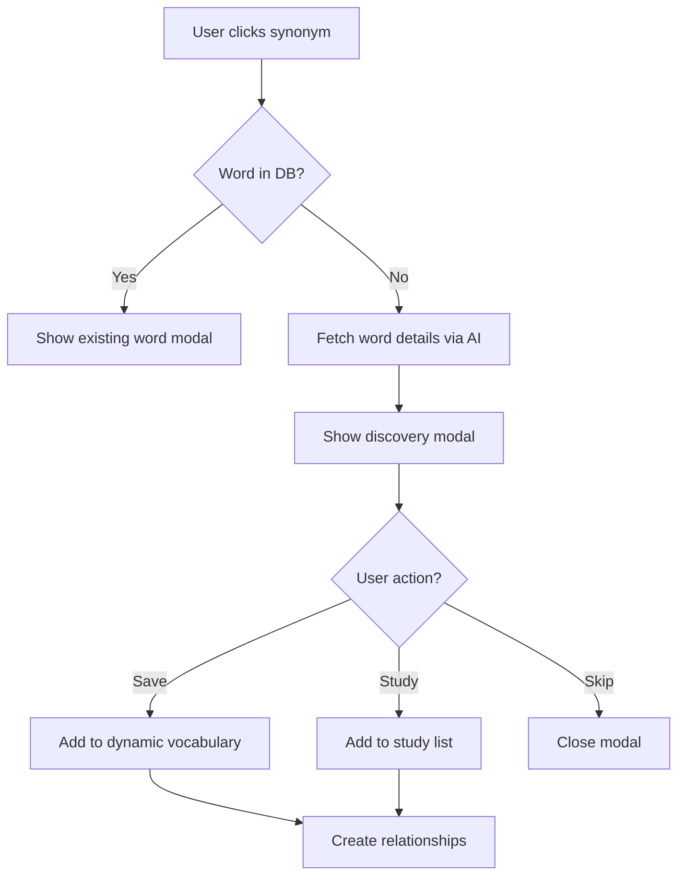

# Dynamic Vocabulary Expansion System Design

## Overview
This document outlines the design for a dynamic vocabulary expansion system that allows users to explore and save synonym words that aren't in the current vocabulary database, while managing relationships between different vocabulary sources and handling definition conflicts.

## Current State Analysis

### Limitations
1. **Synonym Click Behavior**: When users click on AI-generated synonyms, only words already in the database show definitions
2. **Lost Learning Opportunities**: Users can't explore or save interesting synonym words
3. **No Relationship Tracking**: No connection between original words and their synonyms
4. **Single Source Truth**: Only recognizes words from existing vocabulary collections

### Current Architecture
- Veterans vocabulary: 1,821 words from V.ZIP PDF
- ExtractedVocabulary type supports multiple sources (pdf, manual, api)
- Words are stored in separate collections by source

## Proposed System Architecture

### 1. Database Schema Design

#### New Collections

```typescript
// Dynamic Words Collection - AI-discovered words
interface DynamicVocabulary {
  id: string
  word: string
  definition: string // AI-generated Korean definition
  englishDefinition?: string // AI-generated English definition
  partOfSpeech: string[]
  examples: string[]
  pronunciation?: string
  etymology?: string
  realEtymology?: string
  difficulty?: number
  frequency?: number
  
  // Discovery metadata
  discoveredFrom: {
    type: 'synonym' | 'antonym' | 'related' | 'manual_search'
    sourceWordId: string // ID of the word that led to this discovery
    sourceWord: string // For quick reference
    relationship: string // e.g., "synonym of", "antonym of"
  }
  
  // AI generation metadata
  aiGenerated: {
    model: string // e.g., "gpt-4", "claude-3"
    generatedAt: Date
    confidence?: number // 0-1 confidence score
    prompt?: string // For debugging/improvement
  }
  
  // Validation status
  validation: {
    status: 'pending' | 'verified' | 'rejected'
    verifiedBy?: string // userId who verified
    verifiedAt?: Date
    notes?: string
  }
  
  userId: string // User who discovered this word
  createdAt: Date
  updatedAt: Date
}

// Word Relationships Collection
interface WordRelationship {
  id: string
  word1Id: string
  word1: string // Denormalized for quick access
  word2Id: string
  word2: string // Denormalized for quick access
  
  relationship: {
    type: 'synonym' | 'antonym' | 'related' | 'derived' | 'compound'
    strength: number // 0-1, how strong the relationship is
    bidirectional: boolean // true if relationship goes both ways
  }
  
  source: {
    type: 'ai' | 'dictionary' | 'manual' | 'crowdsourced'
    confidence: number // 0-1
  }
  
  userId: string // Who created this relationship
  createdAt: Date
  updatedAt: Date
}

// Definition Variants Collection - Handle multiple definitions
interface DefinitionVariant {
  id: string
  wordId: string
  word: string // Denormalized
  
  definition: {
    korean: string
    english?: string
    simplified?: string // Simplified version for beginners
  }
  
  source: {
    type: 'pdf' | 'ai' | 'dictionary' | 'manual' | 'crowdsourced'
    name: string // e.g., "V.ZIP 3K", "GPT-4", "Merriam-Webster"
    extractedAt: Date
  }
  
  metadata: {
    isPreferred: boolean // Mark primary definition
    useCase?: string // e.g., "formal", "colloquial", "technical"
    domain?: string // e.g., "medical", "legal", "general"
  }
  
  votes: {
    helpful: number
    notHelpful: number
  }
  
  createdAt: Date
  updatedAt: Date
}
```

### 2. Vocabulary Source Hierarchy

```
Master Vocabulary (Unified View)
├── Veterans Vocabulary (V.ZIP PDF) - Authoritative
├── Dynamic Vocabulary (AI-discovered) - Supplementary
├── Custom Vocabulary (User-added) - Personal
└── External Vocabulary (APIs) - Reference

Priority Order:
1. Veterans (PDF sources) - Highest authority
2. Verified Dynamic - Community verified
3. External APIs - Reference quality
4. Unverified Dynamic - Lowest priority
```

### 3. Conflict Resolution Strategy

#### Definition Conflict Resolution

```typescript
interface DefinitionResolver {
  // Get best definition based on context and user preferences
  getBestDefinition(word: string, context?: {
    sourcePreference?: 'pdf' | 'ai' | 'any'
    userLevel?: 'beginner' | 'intermediate' | 'advanced'
    domain?: string
  }): Promise<{
    primary: DefinitionVariant
    alternatives: DefinitionVariant[]
    reasoning: string
  }>
  
  // Merge similar definitions
  mergeDefinitions(variants: DefinitionVariant[]): {
    merged: string
    sources: string[]
    confidence: number
  }
  
  // Detect conflicts
  detectConflicts(variants: DefinitionVariant[]): {
    hasConflict: boolean
    type: 'minor' | 'major' | 'domain-specific'
    details: string
  }
}
```

#### Resolution Rules
1. **Source Authority**: PDF > Verified AI > Dictionary API > Unverified AI
2. **Recency**: Newer definitions preferred for technical terms
3. **User Voting**: Community feedback influences ranking
4. **Context Matching**: Domain-specific definitions when applicable

### 4. API Design

#### Synonym Discovery API

```typescript
// POST /api/vocabulary/discover-word
interface DiscoverWordRequest {
  word: string
  discoveredFrom: {
    sourceWordId: string
    relationship: 'synonym' | 'antonym' | 'related'
  }
  userId: string
}

interface DiscoverWordResponse {
  word: DynamicVocabulary
  existingDefinitions: DefinitionVariant[]
  relationships: WordRelationship[]
  suggestions: {
    relatedWords: string[]
    studyTogether: string[]
  }
}

// POST /api/vocabulary/save-dynamic-word
interface SaveDynamicWordRequest {
  word: string
  definition: string
  englishDefinition?: string
  partOfSpeech: string[]
  examples?: string[]
  discoveredFrom: {
    sourceWordId: string
    relationship: string
  }
  userId: string
}

// GET /api/vocabulary/word-details/:word
interface WordDetailsResponse {
  // Unified view of the word from all sources
  word: string
  primaryDefinition: DefinitionVariant
  allDefinitions: DefinitionVariant[]
  sources: Array<{
    type: string
    name: string
    definition: string
    reliability: number
  }>
  relationships: {
    synonyms: Array<{ word: string; strength: number }>
    antonyms: Array<{ word: string; strength: number }>
    related: Array<{ word: string; type: string }>
  }
  studyStatus?: {
    inVocabulary: boolean
    studied: boolean
    masteryLevel: number
  }
}
```

### 5. UI/UX Flow

#### Synonym Click Flow



#### Discovery Modal Design

```typescript
interface DiscoveryModalProps {
  word: string
  sourceWord: VocabularyWord
  relationship: string
  
  // Actions
  onSave: () => void
  onStudy: () => void
  onSkip: () => void
}

// Modal shows:
// 1. Word with pronunciation
// 2. AI-generated definition (with loading state)
// 3. Source relationship ("Synonym of 'sourceWord'")
// 4. Confidence indicator
// 5. Action buttons: Save to Vocabulary, Add to Study, Skip
```

### 6. Implementation Phases

#### Phase 1: Foundation (Week 1)
- Create new Firestore collections
- Implement basic discovery API
- Add discovery modal component

#### Phase 2: Relationships (Week 2)
- Implement relationship tracking
- Create relationship visualization
- Add bidirectional lookups

#### Phase 3: Conflict Resolution (Week 3)
- Build definition resolver
- Implement voting system
- Add source preference settings

#### Phase 4: Advanced Features (Week 4)
- Batch discovery for multiple synonyms
- Export/import functionality
- Community sharing features

### 7. Data Migration Strategy

```typescript
// Migration script to establish relationships for existing words
async function migrateExistingVocabulary() {
  // 1. Scan all existing words for synonyms/antonyms
  // 2. Create relationship entries
  // 3. Mark PDF sources as authoritative
  // 4. Set up initial definition variants
}
```

### 8. Performance Considerations

1. **Caching Strategy**
   - Cache discovered words for session
   - Preload common synonyms
   - Background sync for relationships

2. **Query Optimization**
   - Composite indexes on word + source
   - Denormalized data for quick access
   - Batch operations for bulk discoveries

3. **API Rate Limiting**
   - Limit discovery API: 10 words/minute
   - Batch requests when possible
   - Queue system for bulk operations

### 9. Future Enhancements

1. **Machine Learning Integration**
   - Learn user's definition preferences
   - Predict useful synonyms
   - Auto-categorize relationships

2. **Community Features**
   - Share word discoveries
   - Collaborative vocabulary building
   - Crowd-sourced definitions

3. **Advanced Analytics**
   - Track discovery patterns
   - Identify knowledge gaps
   - Personalized recommendations

## Implementation Priority

1. **High Priority**
   - Basic discovery flow
   - Save to dynamic vocabulary
   - Simple relationship tracking

2. **Medium Priority**
   - Conflict resolution
   - Definition variants
   - Source preferences

3. **Low Priority**
   - Community features
   - Advanced analytics
   - ML integration

## Success Metrics

1. **User Engagement**
   - % of synonym clicks leading to saves
   - Average words discovered per session
   - Return rate for discovery feature

2. **Data Quality**
   - Accuracy of AI definitions
   - User verification rate
   - Conflict resolution success

3. **Performance**
   - Discovery API response time <500ms
   - Modal load time <200ms
   - Batch operation efficiency

## Security & Privacy

1. **Data Isolation**
   - User-discovered words are private by default
   - Optional sharing with community
   - Admin approval for public words

2. **Content Moderation**
   - Automated filtering for inappropriate content
   - Community reporting system
   - Admin review queue

3. **API Security**
   - Rate limiting per user
   - Authentication required
   - Input validation and sanitization