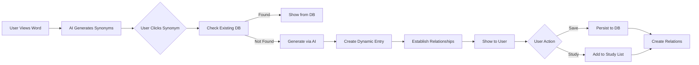

# Vocabulary Relationship Model Design

## Overview
This document details the relationship model between different vocabulary sources and how words connect to each other in the dynamic vocabulary system.

## Relationship Types

### 1. Word-to-Word Relationships

```
┌─────────────┐     synonym      ┌─────────────┐
│   abolish   │ ←──────────────→ │  eliminate  │
└─────────────┘                   └─────────────┘
       ↑                                 ↑
       │ antonym                         │ synonym
       ↓                                 ↓
┌─────────────┐                   ┌─────────────┐
│  establish  │                   │   remove    │
└─────────────┘                   └─────────────┘
```

**Supported Relationships:**
- **Synonym**: Words with similar meanings (bidirectional)
- **Antonym**: Words with opposite meanings (bidirectional)  
- **Derived**: Word derived from another (directional)
- **Related**: Conceptually related words (bidirectional)
- **Compound**: Part of compound word (directional)

### 2. Source-to-Word Relationships

```
┌─────────────────────┐
│   Master Word DB    │
├─────────────────────┤
│  ┌───────────────┐  │     owns      ┌─────────────┐
│  │ Veterans PDF  │  ├──────────────→ │   abolish   │
│  └───────────────┘  │                └─────────────┘
│                     │                       ↑
│  ┌───────────────┐  │                       │ discovered
│  │Dynamic (AI)   │  ├──────────────────────┘
│  └───────────────┘  │
└─────────────────────┘
```

**Source Hierarchy:**
1. **Veterans PDF** (Authoritative)
   - Original definitions from V.ZIP
   - Highest trust level
   - Cannot be modified

2. **Dynamic Vocabulary** (Supplementary)
   - AI-discovered words
   - User-contributed definitions
   - Requires validation

3. **External APIs** (Reference)
   - Dictionary APIs
   - Used for verification
   - Not stored permanently

## Data Flow Architecture

### Discovery Flow



### Relationship Storage Model

```typescript
// Bidirectional Relationship Example
{
  // Forward relationship
  {
    id: "rel_001",
    word1Id: "word_abolish",
    word1: "abolish",
    word2Id: "word_eliminate", 
    word2: "eliminate",
    relationship: {
      type: "synonym",
      strength: 0.9,
      bidirectional: true
    },
    source: {
      type: "ai",
      confidence: 0.85
    }
  },
  
  // Reverse relationship (automatically created)
  {
    id: "rel_002",
    word1Id: "word_eliminate",
    word1: "eliminate", 
    word2Id: "word_abolish",
    word2: "abolish",
    relationship: {
      type: "synonym",
      strength: 0.9,
      bidirectional: true
    },
    source: {
      type: "ai",
      confidence: 0.85
    }
  }
}
```

## Conflict Resolution Scenarios

### Scenario 1: Multiple Definitions from Different Sources

```
Word: "sanction"

PDF Definition: "제재, 처벌"
AI Definition: "승인, 허가; 제재"
Dictionary API: "공식적 허가; 처벌적 조치"

Resolution:
1. Recognize dual meaning (approval vs punishment)
2. Create two definition variants
3. Mark PDF as primary for SAT context
4. Show context-dependent definitions
```

### Scenario 2: Synonym Strength Conflicts

```
"Happy" synonyms:

From PDF: joyful (primary)
From AI: glad (0.9), content (0.7), elated (0.8)
User Added: cheerful (manual)

Resolution:
1. Respect PDF primary designation
2. Order others by strength score
3. Allow user preference override
4. Track usage for reranking
```

### Scenario 3: Cross-Source Word Discovery

```
User Flow:
1. Studies "ubiquitous" (PDF source)
2. Clicks synonym "omnipresent" (not in PDF)
3. System generates AI definition
4. User saves to personal vocabulary

Result:
- "omnipresent" added to dynamic vocabulary
- Relationship created: ubiquitous <-> omnipresent
- Source tracking: PDF -> AI discovery
- User ownership maintained
```

## Implementation Details

### 1. Firestore Query Patterns

```typescript
// Get all relationships for a word
const getWordRelationships = async (wordId: string) => {
  const db = getFirestore()
  
  // Query both directions
  const forward = await db.collection('word_relationships')
    .where('word1Id', '==', wordId)
    .get()
    
  const reverse = await db.collection('word_relationships')
    .where('word2Id', '==', wordId)
    .where('relationship.bidirectional', '==', true)
    .get()
    
  return [...forward.docs, ...reverse.docs]
}

// Get words by relationship type
const getSynonyms = async (wordId: string) => {
  const relationships = await getWordRelationships(wordId)
  return relationships
    .filter(r => r.data().relationship.type === 'synonym')
    .sort((a, b) => b.data().relationship.strength - a.data().relationship.strength)
}
```

### 2. Relationship Strength Calculation

```typescript
interface StrengthFactors {
  semanticSimilarity: number  // 0-1 from AI
  userVotes: number          // Normalized 0-1
  coOccurrence: number       // How often used together
  sourceReliability: number  // Based on source type
}

function calculateRelationshipStrength(factors: StrengthFactors): number {
  const weights = {
    semanticSimilarity: 0.4,
    userVotes: 0.3,
    coOccurrence: 0.2,
    sourceReliability: 0.1
  }
  
  return Object.entries(weights).reduce((sum, [key, weight]) => {
    return sum + (factors[key as keyof StrengthFactors] * weight)
  }, 0)
}
```

### 3. Relationship Visualization Component

```typescript
interface RelationshipGraphProps {
  centralWord: VocabularyWord
  depth: number // How many levels to show
  filter?: RelationshipType[]
}

// Visual representation:
//         antonym
//     ┌────────────┐
//     │ establish  │
//     └────────────┘
//            ↑
//            │
//     ┌────────────┐
//     │  abolish   │ ← Central Word
//     └────────────┘
//        ↙    ↘
//    0.9/     \0.8
//      /       \
// ┌────────┐ ┌────────┐
// │eliminate│ │eradicate│
// └────────┘ └────────┘
//  synonyms (with strength)
```

## Performance Optimizations

### 1. Caching Strategy
- Cache discovered relationships for session
- Precompute common relationship paths
- Background sync for updates

### 2. Query Optimization
- Composite indexes: (word1Id, relationship.type)
- Denormalized word names for display
- Limit depth of relationship traversal

### 3. Batch Operations
- Bulk create relationships
- Batch validate AI discoveries
- Queue for async processing

## Migration Plan

### Phase 1: Extract Existing Relationships
```typescript
// Scan existing vocabulary for inline synonyms/antonyms
async function extractExistingRelationships() {
  const words = await getAllVeteransWords()
  
  for (const word of words) {
    if (word.synonyms?.length) {
      await createRelationships(word, word.synonyms, 'synonym')
    }
    if (word.antonyms?.length) {
      await createRelationships(word, word.antonyms, 'antonym')
    }
  }
}
```

### Phase 2: Build Relationship Graph
- Create bidirectional links
- Calculate initial strengths
- Verify relationship quality

### Phase 3: Enable Discovery Features
- Activate synonym click handling
- Enable AI discovery
- Start collecting user feedback

## Future Enhancements

1. **Semantic Networks**
   - Multi-hop relationships
   - Concept clustering
   - Topic modeling

2. **Learning Paths**
   - Related word suggestions
   - Difficulty progression
   - Thematic groupings

3. **Collaborative Features**
   - User-submitted relationships
   - Community validation
   - Shared word networks